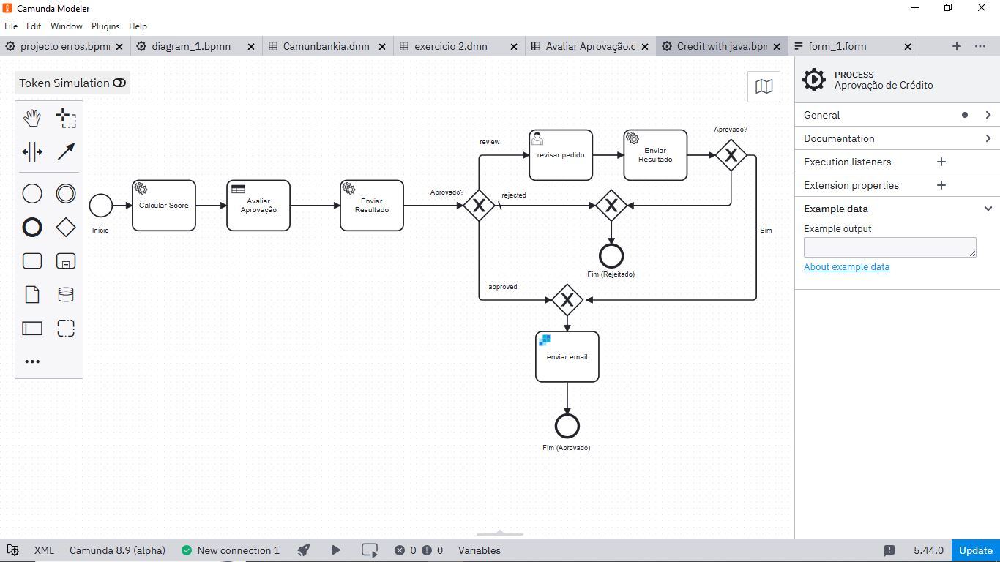
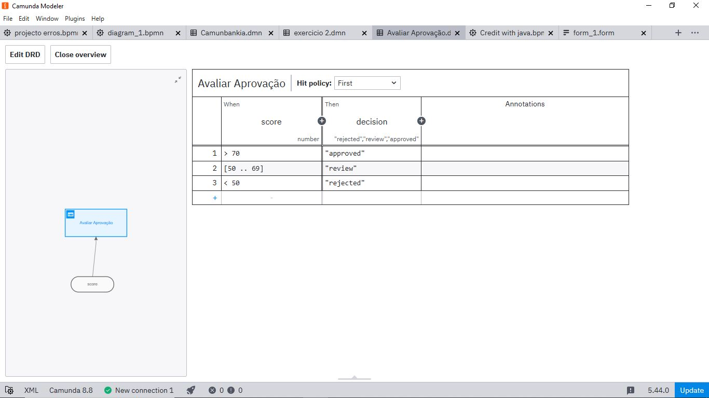

# 💳 Credit Approval System — Camunda 8 + Java

## 🚀 Overview

This project implements a **real-world credit approval workflow** using Camunda 8 and Java.

It simulates how fintech systems automate credit decisions while still allowing human intervention when needed.

---

## 🧠 Problem

Credit approval is not just a simple "yes or no".

It requires:

* Risk evaluation
* Business rules
* Manual review in uncertain cases

This project demonstrates how to orchestrate that using BPMN and DMN.

---

## ⚙️ Solution

* Camunda 8 (Zeebe) orchestrates the workflow
* Java (Spring Boot) executes business logic
* DMN evaluates decisions automatically
* User Task handles manual review
* Workers process tasks asynchronously

---

## 🔄 Workflow



---

## ⚖️ Decision Table



---

## 🧩 Features

* Automated credit scoring
* Rule-based decision engine (DMN)
* Manual approval flow
* Email notification (SendGrid)
* Persistent state with database
* Idempotent result processing

---

## 🛠️ Tech Stack

* Java 21
* Spring Boot
* Camunda 8 (Zeebe)
* Docker
* BPMN / DMN / FEEL

---

## ▶️ How to Run

### 1. Start Camunda

```bash
cd camunda
docker compose up -d
```

### 2. Run backend

```bash
cd backend
./mvnw spring-boot:run
```

---

## 🧪 Example Request

```json
{
  "name": "Rudi",
  "income": 5000,
  "age": 30
}
```

---

## 📈 What I Learned

* Workflow orchestration vs business logic separation
* BPMN + DMN in real applications
* Building resilient async systems
* Designing scalable backend services

---

## 🚀 Next Steps

* Add KYC process
* Integrate AI for fraud detection
* Event-driven architecture (Kafka)
* Observability (logs + metrics)

---

## 👨‍💻 Author

Building my journey to become a **Camunda Architect** 🚀
